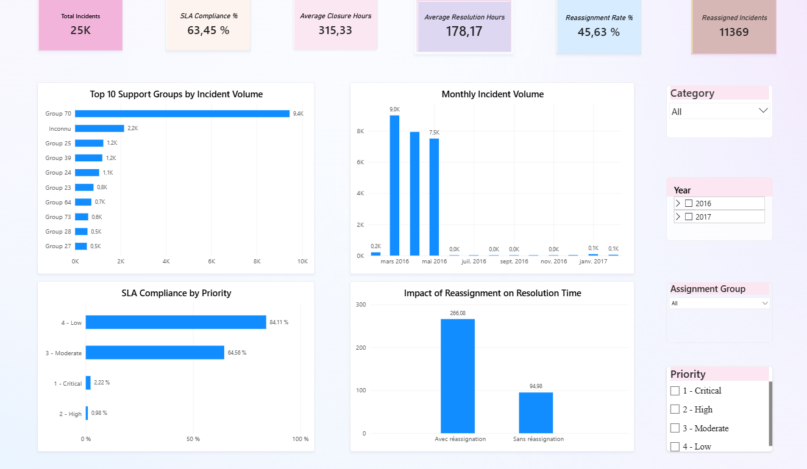

# IT Incident Management Analytics


Projet d'analyse de données de bout en bout combinant **Python**, **SQL**, **Power BI** et **DAX** afin d'analyser la performance du traitement des incidents IT.

Le projet transforme un journal d'incidents ITSM en indicateurs opérationnels, analyses structurées, recommandations métier et tableau de bord interactif. Il permet aux responsables IT de suivre la qualité de service, d'identifier les risques de non-respect des SLA et de prioriser les actions d'amélioration.

## Résultats clés

| Indicateur | Résultat | Lecture métier |
| --- | ---: | --- |
| Incidents analysés | 24 918 | Base suffisamment large pour suivre la performance du support IT |
| Conformité SLA globale | 63,45 % | Niveau perfectible, avec un risque réel de non-respect des engagements |
| Temps moyen de résolution | 178,17 h | Les délais moyens restent élevés et doivent être suivis par priorité et groupe |
| SLA — priorités Critical / High | 2,22 % / 0,98 % | Les incidents les plus sensibles présentent les taux de conformité les plus faibles |
| Temps de résolution selon réassignation | 266 h contre 95 h | Les incidents réassignés sont associés à des délais nettement plus longs |

## Tableau de bord Power BI

Le tableau de bord s'appuie directement sur `data/processed/incident_clean.csv`, une table analytique contenant une ligne par incident. Les indicateurs sont calculés avec des mesures DAX et réagissent aux filtres interactifs de priorité, groupe d'affectation, catégorie et période d'ouverture.

La capture ci-dessous présente la vue d'ensemble finale du rapport.



Le tableau de bord comprend :

- six cartes de synthèse : volume total, conformité SLA, délais moyens de résolution et de clôture, taux de réassignation et nombre d'incidents réassignés ;
- une analyse mensuelle du volume d'incidents ;
- une comparaison de la conformité SLA par priorité ;
- un classement des dix groupes support les plus sollicités ;
- une comparaison du temps de résolution selon la présence ou non d'une réassignation ;
- des filtres interactifs par catégorie, année, groupe d'affectation et priorité.

### Principales mesures DAX

```DAX
Total Incidents =
DISTINCTCOUNT(incident_clean[number])

SLA Compliance % =
DIVIDE(SUM(incident_clean[sla_compliant]), [Total Incidents], 0)

Average Resolution Hours =
AVERAGE(incident_clean[resolution_time_hours])

Average Closure Hours =
AVERAGE(incident_clean[closure_time_hours])

Reassigned Incidents =
CALCULATE([Total Incidents], incident_clean[reassignment_count] > 0)

Reassignment Rate % =
DIVIDE([Reassigned Incidents], [Total Incidents], 0)
```

### Enseignements métier

- La conformité SLA globale atteint 63,45 %, ce qui met en évidence une marge d'amélioration importante.
- Les priorités Critical et High enregistrent moins de 3 % de conformité SLA et constituent le principal point d'alerte.
- Les incidents réassignés nécessitent environ 266 heures de résolution, contre 95 heures sans réassignation.
- Le groupe 70 concentre la plus grande part du volume et doit faire l'objet d'un suivi régulier de sa charge.
- Les incidents associés au groupe `Inconnu` signalent un besoin d'amélioration de la qualité d'affectation.

### Recommandations opérationnelles

1. Mettre en place un suivi renforcé des incidents Critical et High.
2. Améliorer la qualification initiale et les règles de routage afin de limiter les réassignations.
3. Suivre conjointement le volume, la conformité SLA et le temps de résolution pour chaque groupe support.
4. Contrôler les incidents non attribués ou associés au groupe `Inconnu`.
5. Définir des alertes sur les incidents proches de dépasser leur délai SLA.

## Problématique métier

Les équipes support IT traitent un volume important d'incidents, répartis par priorité, catégorie et groupe d'affectation. Sans analyse structurée, il devient difficile d'identifier les risques de non-respect des SLA, les groupes support surchargés et les problèmes opérationnels récurrents.

Ce projet répond aux questions suivantes :

- Les incidents sont-ils résolus dans les délais attendus ?
- Quels groupes support concentrent la charge opérationnelle la plus élevée ?
- Quels facteurs sont associés à des délais de résolution plus longs ?
- Dans quelle mesure les réassignations allongent-elles le temps de résolution ?

## Source des données

Le projet utilise un journal d'événements d'incidents ITSM nommé `incident_event_log.csv`. Les données sont anonymisées : les utilisateurs, groupes, lieux et catégories sont remplacés par des identifiants génériques comme `Caller 2403`, `Group 70`, `Location 143` ou `Category 55`.

Plus de détails : [docs/Dataset_Source.md](docs/Dataset_Source.md).

## Déroulé analytique

1. **Compréhension des données**
   Exploration du fichier source, des champs disponibles, des valeurs manquantes, des doublons métier et de la période couverte.

2. **Nettoyage des données**
   Conversion des dates, traitement des valeurs manquantes utiles, création d'une table analytique avec une seule ligne par incident.

3. **Analyse exploratoire**
   Analyse du volume, du SLA, des priorités, des groupes support et de l'effet des réassignations.

4. **Analyse SQL**
   Création d'une base SQLite et validation des KPI avec des requêtes SQL.

5. **Synthèse métier**
   Traduction des résultats en recommandations opérationnelles.

6. **Tableau de bord Power BI**
   Création d'un rapport interactif alimenté par `incident_clean.csv` et des mesures DAX dynamiques.

## KPI suivis

- Nombre total d'incidents.
- Taux de conformité SLA.
- Temps moyen de résolution.
- Temps moyen de clôture.
- Nombre moyen de réassignations.
- Nombre moyen de réouvertures.
- Volume d'incidents par mois.
- Conformité SLA par priorité.
- Charge et performance par groupe support.

## Technologies utilisées

| Catégorie | Technologies |
| --- | --- |
| Programmation | Python |
| Analyse de données | Pandas, NumPy |
| Base de données | SQLite |
| Requêtes | SQL |
| Visualisation | Matplotlib |
| BI / Tableau de bord | Power BI, mesures DAX |
| Environnement | Jupyter Notebook |
| Versioning | Git |

## Structure du dépôt

```text
IT-Service-Performance-Analytics/
|
|-- data/
|   |-- raw/          données sources des incidents
|   |-- processed/    table analytique `incident_clean.csv`
|   `-- database/     base SQLite générée pour l'analyse SQL
|
|-- docs/
|   |-- images/       captures du tableau de bord
|   `-- *.md          documentation métier et technique
|
|-- notebooks/        déroulé analytique de bout en bout
|-- powerbi/          projet PBIP, rapport et modèle sémantique
|-- requirements.txt  versions des dépendances Python
`-- README.md         présentation du projet
```

## Notebooks

1. `01_Data_Understanding.ipynb` - exploration initiale des données.
2. `02_Data_Cleaning.ipynb` - nettoyage et préparation de la table incident.
3. `03_Exploratory_Data_Analysis.ipynb` - analyse des KPI et visualisations.
4. `04_SQL_Analysis.ipynb` - requêtes KPI SQL pour contrôler les résultats.
5. `05_Business_Insights.ipynb` - KPI calculés depuis la table incident, enseignements métier et recommandations.

## Lancer le projet

```powershell
python -m venv .venv
.\.venv\Scripts\Activate.ps1
pip install -r requirements.txt
jupyter notebook
```

Pour exécuter tous les notebooks :

```powershell
jupyter nbconvert --to notebook --execute --inplace notebooks/*.ipynb
```
